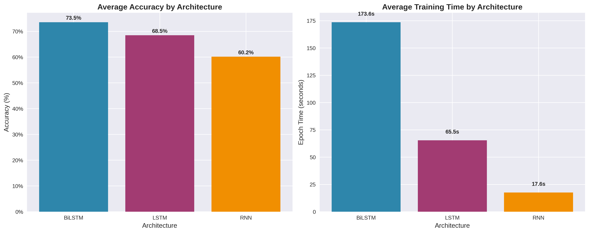

# Comparing RNN, LSTM and BiLSTM for Sentiment Classification (IMDb)

A controlled experiment in PyTorch: how much do architecture, optimizer, sequence length, activation function and gradient clipping
matter when classifying IMDb movie reviews as positive or negative? Twenty configurations were trained under the same seed, vocabulary
and training budget, and compared on accuracy, F1 and training time.



## Results (50,000 IMDb reviews, 50/50 stratified train/test split, 10 epochs per run)

**Best configuration:** BiLSTM, sigmoid head activation, RMSprop, 100-word sequences, no gradient clipping:
**83.03% accuracy, 83.01% macro-F1**, at about 695 s per epoch.

| Factor | Finding (averages over the runs that used each setting) |
|---|---|
| Architecture | Accuracy RNN 60.2% (6 runs), LSTM 68.5% (7), BiLSTM 73.6% (7). BiLSTM costs about 10× the RNN's training time per epoch (174 s vs 18 s) |
| Sequence length | The three best runs all used 100 words (81.3%, 82.2%, 83.0%), and epoch time grows about 10× from 25 to 100 words. The *average* at 100 words is lower (66.3% vs 68.8% at 25), because the three runs that never learned were all 100-word runs |
| Optimizer | Adam 72.7% across 9 runs, none stuck. RMSprop 70.8% (5 runs, 1 stuck at 50%). SGD 57.8% (6 runs, 2 stuck at 50%, best 67.7%) |
| Gradient clipping | The three runs stuck at 50% accuracy (chance) were all 100-word runs *without* clipping; with clipping, no run failed to train |
| Cost vs accuracy | LSTM + tanh + Adam at 100 words reached 81.3% at 113 s per epoch, within 2 points of the best run at about a sixth of its training time |

These factor summaries were recomputed from the 20-run results table in `Report.md`. The per-factor tables further down in `Report.md`
(sequence length, optimizer) don't match that run table, so use the numbers here.

The full results table, per-factor tables, training curves and discussion are in [`Report.md`](Report.md); the charts are in `plots/`.

## Reading these results carefully

- **Best epoch chosen on the test set.** `train.py` keeps the epoch with the highest *test* accuracy, and `best_test_f1` is the maximum
  F1 over epochs. So the reported numbers are slightly optimistic. The clean fix is to split a validation set off the training half,
  select the epoch on it, and score the test set once.
- **The "best model" weights aren't actually the best epoch.** `model.state_dict().copy()` is a shallow copy, so the saved tensors keep
  changing as training continues, and the model restored at the end is the final epoch's. Use `copy.deepcopy(model.state_dict())`.
  This doesn't change the reported metrics, which are taken from the per-epoch log.
- **20 configurations, not a full grid.** Each factor's average mixes different combinations of the other factors (for example, every
  run that failed was both a 100-word run and unclipped, so the effects of length and clipping can't be separated), so the per-factor averages are indicative, not controlled comparisons. Single runs per
  configuration also mean no error bars.
- **"Activation" means the classifier head.** The chosen activation is applied to the final hidden state and the dense layers.
  The recurrent cells themselves use PyTorch's defaults (tanh for `nn.RNN`, gates for `nn.LSTM`).
- `Report.md` lists a hidden size of 128; `experiment_controller.py` uses 64.

## How it works

| Step | Where |
|---|---|
| Load `data/data.csv` (columns `text`, `label`), lowercase, strip punctuation, tokenize, keep the 10,000 most frequent words, pad/truncate to 25/50/100 tokens | `code_files/preprocess.py` |
| Embedding (100-d) → 2-layer RNN / LSTM / BiLSTM → two dense layers → sigmoid output | `code_files/models.py` |
| Training loop with optional gradient clipping (max norm 1.0), binary cross-entropy, accuracy and macro-F1 per epoch | `code_files/train.py` |
| The 20 configurations, fixed seeds (42), results table | `code_files/experiment_controller.py`, `code_files/main.py` |
| Summary tables and plots | `code_files/evaluate.py`, `code_files/utils.py` |

## Run it

```bash
git clone https://github.com/HarshitGadge/Sentiment_Analysis_using_RNN_LSTM_BiLSTM.git
cd Sentiment_Analysis_using_RNN_LSTM_BiLSTM
python -m venv .venv && source .venv/bin/activate
pip install -r code_files/requirements.txt
python -c "import nltk; nltk.download('punkt')"
```

Put the IMDb reviews in `data/data.csv` with a `text` column and a `label` column (`positive` / `negative` or 1 / 0). The 50,000-review
IMDb dataset is available from Stanford (https://ai.stanford.edu/~amaas/data/sentiment/) or as a single CSV on Kaggle. Then:

```bash
cd code_files
python main.py        # runs all 20 configurations and writes results_summary.csv
```

The full sweep takes several hours on a CPU because of the 100-word BiLSTM runs; a GPU is picked up automatically if available.

## Files

```
code_files/     preprocessing, models, training, experiment runner
plots/          charts used in Report.md
Report.md       full results and analysis
```

Tools: PyTorch, pandas, NumPy, scikit-learn, NLTK, matplotlib/seaborn.
